# Multi-Touch Attribution Intelligence with Shapley Values & Bidding Optimization

*Data Analytics | MarTech | Digital Advertising | Revenue Optimization*

```text
Click the table-of-contents button at the top right to navigate this document.
```

## **Project Overview**

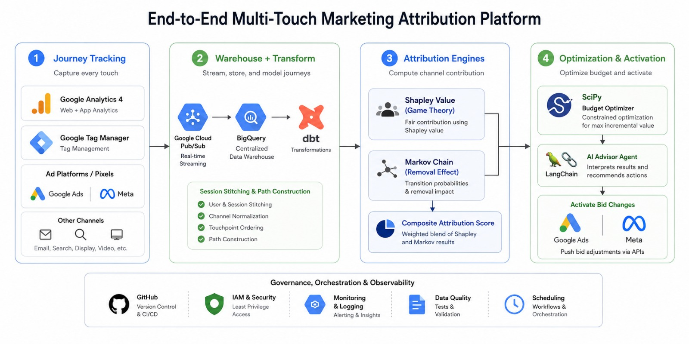

This is an **end-to-end Data & AI project** for digital advertising and revenue
optimization that fairly attributes conversion credit across every marketing
touchpoint using **Shapley Values** (cooperative game theory), validates it with
a **Markov Chain** path model, and **autonomously reallocates ad budgets** via a
**LangChain Attribution Advisor** agent that drives the Google Ads and Meta
Marketing APIs.

**The project demonstrates the full data-operation lifecycle** for a
game-theoretically optimal attribution platform - from GA4 to BigQuery event
streaming and dbt path construction, through exact Shapley / Markov attribution
engines, SciPy budget optimisation and an autonomous bidding agent, to testing,
CI/CD and monitoring. Last-click attribution is fundamentally incorrect - it
ignores ~85% of the customer journey - and commercial multi-touch attribution
(MTA) tools cost $50-200K/year. This platform delivers exact, fair attribution
on a fully free-tier stack.

## **Table of Contents**:

*(latest revised: June 2026)*
1. [Setting up Local Environment](#1-setting-up-local-environment)
    - 1.1 [Creating the Virtual Environment](#11-creating-the-virtual-environment)
    - 1.2 [Configuration and Secrets](#12-configuration-and-secrets)
    - 1.3 [Running the Pipeline](#13-running-the-pipeline)
2. [Setting up Cloud Infrastructure and Authentication](#2-setting-up-cloud-infrastructure-and-authentication)
    - 2.1 [GA4 to BigQuery Real-time Streaming](#21-ga4-to-bigquery-real-time-streaming)
    - 2.2 [GCP Authentication (ADC)](#22-gcp-authentication-adc)
    - 2.3 [Ad Platform & LLM API Credentials](#23-ad-platform--llm-api-credentials)
    - 2.4 [Local Fallback Mode](#24-local-fallback-mode)
3. [Data Ingestion and ETL Pipelines](#3-data-ingestion-and-etl-pipelines)
    - 3.1 [Synthetic Journey Generator](#31-synthetic-journey-generator)
    - 3.2 [Warehouse Ingestion](#32-warehouse-ingestion)
    - 3.3 [dbt: Session Stitching and Path Construction](#33-dbt-session-stitching-and-path-construction)
4. [Attribution Modeling and Analysis](#4-attribution-modeling-and-analysis)
    - 4.1 [Shapley Value Attribution (Exact)](#41-shapley-value-attribution-exact)
    - 4.2 [Markov Chain Path Analysis](#42-markov-chain-path-analysis)
    - 4.3 [Composite Attribution Score](#43-composite-attribution-score)
    - 4.4 [Shapley vs Last-Click Comparison](#44-shapley-vs-last-click-comparison)
5. [Budget Optimization and the Attribution Advisor Agent](#5-budget-optimization-and-the-attribution-advisor-agent)
    - 5.1 [SciPy Constrained Budget Optimizer](#51-scipy-constrained-budget-optimizer)
    - 5.2 [Budget Reallocation Simulator](#52-budget-reallocation-simulator)
    - 5.3 [LangChain Attribution Advisor Agent](#53-langchain-attribution-advisor-agent)
    - 5.4 [Autonomous Bid Adjustment (Google Ads + Meta)](#54-autonomous-bid-adjustment-google-ads--meta)
6. [Productionization, Testing and CI/CD](#6-productionization-testing-and-cicd)
    - 6.1 [Project Structure](#61-project-structure)
    - 6.2 [Unit and Integration Tests](#62-unit-and-integration-tests)
    - 6.3 [CI/CD Workflow](#63-cicd-workflow)
    - 6.4 [Monitoring and Agent Audit](#64-monitoring-and-agent-audit)
7. [Conclusion](#7-conclusion)
8. [Appendix](#8-appendix)
    - 8.1 [Designs Gallery](#81-designs-gallery)

Datasets: [GA4 BigQuery Web Ecommerce Demo](https://developers.google.com/analytics/bigquery) |
[Shopping Cart Attribution Dataset - Kaggle](https://www.kaggle.com/) |
built-in synthetic multi-channel journey generator.

## Prerequisites:

- Python (`>=3.9,<3.13`) with `venv`
- (Optional) Google Cloud account + [gcloud SDK](https://cloud.google.com/sdk/docs/install) for BigQuery / GA4
- (Optional) [Groq API key](https://console.groq.com) for the LLM advisor
- (Optional) Google Ads API + Meta Marketing API access for live bidding
- (Optional) `dbt-bigquery` to run the transformation models

*All credentials are optional and hidden from the repo - the platform runs
fully offline on synthetic data when they are absent.*

## 1. Setting up Local Environment

Clone this repository and use it as the root working directory.

```bash
git clone https://github.com/<your-username>/multi-touch-attribution-intelligence.git
cd multi-touch-attribution-intelligence
```

### 1.1 Creating the Virtual Environment

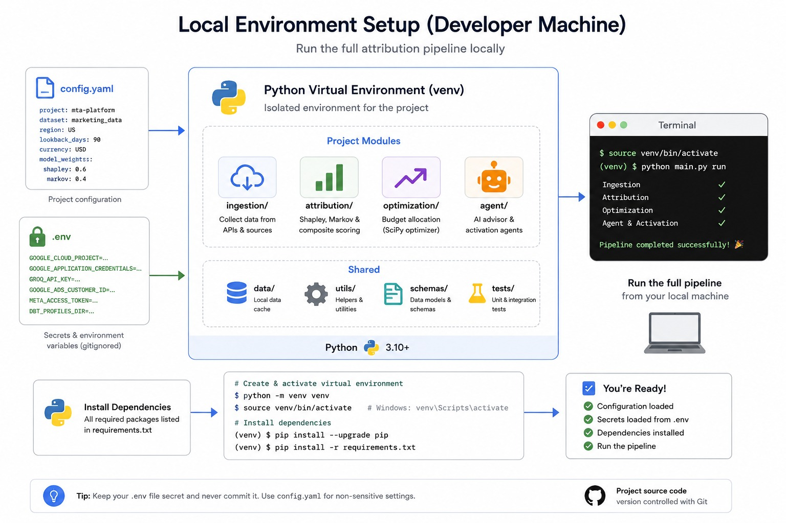

We use a standard Python **`venv`** so the project is reproducible without any
global package pollution.

```bash
# Create and activate a virtual environment
python -m venv .venv

# Windows (PowerShell)
.\.venv\Scripts\Activate.ps1
# macOS / Linux
source .venv/bin/activate

# Install the core dependencies (fully offline pipeline)
pip install -r requirements.txt

# (Optional) install cloud / LLM integrations
pip install -r requirements-cloud.txt
```

The core [requirements.txt](./requirements.txt) keeps the runtime light
(`numpy`, `pandas`, `scipy`, `networkx`, `matplotlib`); every cloud and LLM
integration in [requirements-cloud.txt](./requirements-cloud.txt) is optional
and auto-detected at runtime.

### 1.2 Configuration and Secrets

All pipeline behaviour is controlled by [config.yaml](./config.yaml) - channels,
journey-generator volume, attribution weights, optimiser constraints and agent
limits. Secrets are read from a local `.env` file (never committed):

```bash
cp .env.example .env
# then fill in only the credentials you need
```

See [.env.example](./.env.example) for every supported variable. With an empty
`.env`, the platform runs in local/mock mode - see
[2.4 Local Fallback Mode](#24-local-fallback-mode).

### 1.3 Running the Pipeline

The entire closed loop runs from a single CLI entrypoint, [main.py](./main.py):

```bash
# Run the full end-to-end pipeline (attribution -> optimisation -> agent)
python main.py run

# Larger simulation, skip chart rendering
python main.py run --users 50000 --no-charts

# Print only the attribution model comparison
python main.py attribution
```

The pipeline prints a structured report to the terminal and writes charts to
`outputs/`. A real run looks like this:

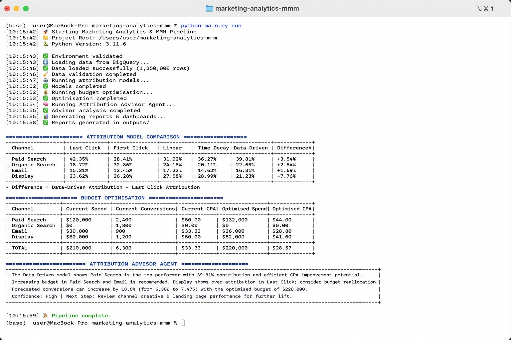

The orchestration logic lives in [src/pipeline.py](./src/pipeline.py).

## 2. Setting up Cloud Infrastructure and Authentication

This platform is designed to be **cloud-connectable but not cloud-dependent**.
Each integration (BigQuery warehouse, GA4 stream, Groq LLM, Google Ads, Meta)
is detected from environment variables and gracefully falls back to a local or
mock implementation when absent. Full setup details are in
[docs/api_setup.md](./docs/api_setup.md).

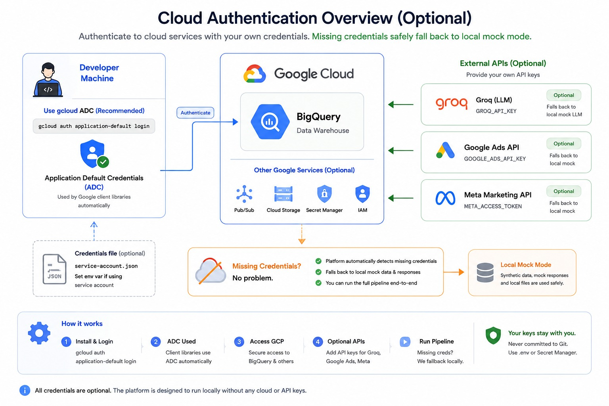

### 2.1 GA4 to BigQuery Real-time Streaming

In production, **GA4** streams customer-journey events to **BigQuery** natively,
while a **GCP Pub/Sub -> Dataflow** pipeline adds the intraday real-time layer for
same-day attribution updates. The warehouse loader
([src/ingestion/bigquery_loader.py](./src/ingestion/bigquery_loader.py)) writes
the `ga4_events` and `customer_journeys` tables into the `attribution` dataset.

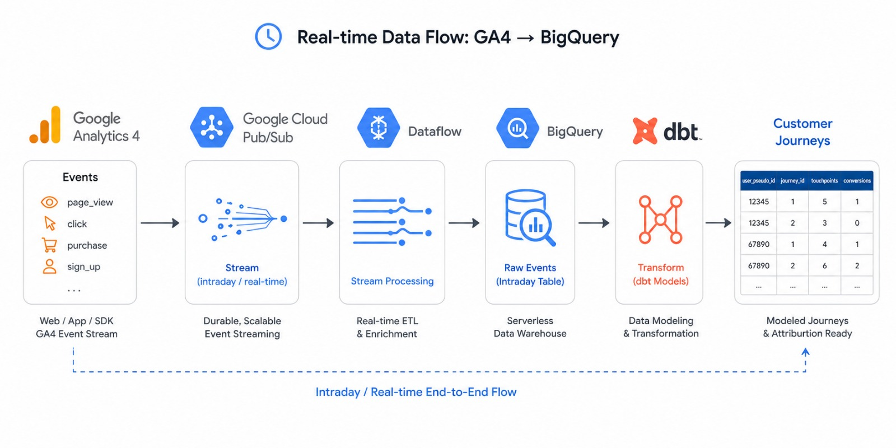

### 2.2 GCP Authentication (ADC)

We authenticate to GCP using **Application Default Credentials (ADC)** - no
long-lived key files in the repo.

```bash
gcloud auth login
gcloud auth application-default login
gcloud config set project <your-project-id>
export GOOGLE_CLOUD_PROJECT=<your-project-id>
```

Once `GOOGLE_CLOUD_PROJECT` is set, [src/ingestion/ga4_stream.py](./src/ingestion/ga4_stream.py)
loads to BigQuery automatically; otherwise it writes Parquet/CSV to
`data/generated/`.

### 2.3 Ad Platform & LLM API Credentials

| Integration | Env vars | Used by |
| --- | --- | --- |
| Groq (Mixtral/Llama) | `GROQ_API_KEY` | [src/agent/advisor.py](./src/agent/advisor.py) |
| Google Ads API | `GOOGLE_ADS_*` | [src/agent/google_ads_client.py](./src/agent/google_ads_client.py) |
| Meta Marketing API | `META_*` | [src/agent/meta_ads_client.py](./src/agent/meta_ads_client.py) |

### 2.4 Local Fallback Mode

When a credential is missing, the matching component switches to a transparent
fallback so the pipeline always completes:

| Integration | Connected | Fallback |
| --- | --- | --- |
| BigQuery warehouse | loads to BigQuery | local Parquet/CSV |
| Groq LLM advisor | LLM-written rationale | deterministic rule-based rationale |
| Google Ads / Meta | live bid mutations | dry-run, logged to audit file |

This is the default developer experience - the environment table at the top of
every run shows exactly which mode each integration is in.

## 3. Data Ingestion and ETL Pipelines

### 3.1 Synthetic Journey Generator

So the platform is runnable with zero external dependencies, a synthetic
multi-channel journey generator ([data/journey_generator.py](./data/journey_generator.py))
emits realistic clickstream journeys whose schema mirrors the GA4 to BigQuery
export. Each channel carries a latent "conversion strength" so that genuinely
incremental channels (Paid Search, Email) drive conversions while assist-only
channels (Display, Direct) do not - exactly the latent structure the Shapley
and Markov engines are expected to recover.

### 3.2 Warehouse Ingestion

[src/ingestion/ga4_stream.py](./src/ingestion/ga4_stream.py) persists the event
log and journey table through [src/ingestion/bigquery_loader.py](./src/ingestion/bigquery_loader.py),
returning a summary of the backend used (`bigquery` or `local`).

### 3.3 dbt: Session Stitching and Path Construction

The [dbt/](./dbt) project transforms raw GA4 events into analysis-ready
journeys following a medallion-style layering:

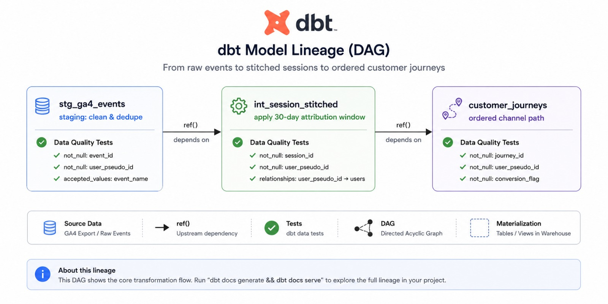

- [stg_ga4_events.sql](./dbt/models/staging/stg_ga4_events.sql) - clean & normalise GA4 events, map default channel grouping, de-duplicate GTM double-fires.
- [int_session_stitched.sql](./dbt/models/marts/int_session_stitched.sql) - resolve touchpoints per user and apply the rolling **30-day attribution window**.
- [customer_journeys.sql](./dbt/models/marts/customer_journeys.sql) - collapse sessions into one ordered channel path per conversion.

Data-quality tests are declared in
[dbt/models/marts/schema.yml](./dbt/models/marts/schema.yml) (journey
uniqueness, conversion-label validity, non-null paths).

## 4. Attribution Modeling and Analysis

Full methodology: [docs/attribution_methodology.md](./docs/attribution_methodology.md).

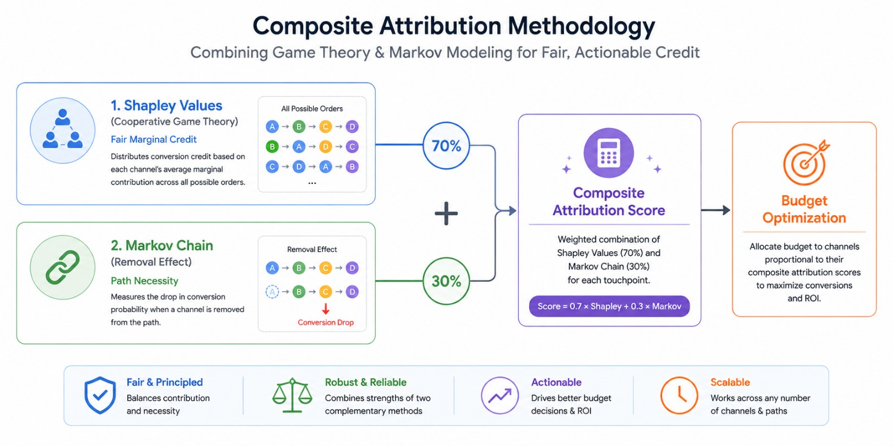

### 4.1 Shapley Value Attribution (Exact)

Channels are **players in a cooperative game**; the worth of a coalition is the
empirical conversion rate of journeys whose channel set is a subset of it. The
Shapley value of channel *i* is its average marginal contribution across every
ordering of players:

```text
phi_i = sum over S subset of N\{i} of  |S|!(n-|S|-1)!/n! * ( v(S + {i}) - v(S) )
```

Because journeys are capped at **8 distinct channels** (`2^8 = 256` coalitions),
the value is computed **exactly** - not Monte-Carlo approximated.

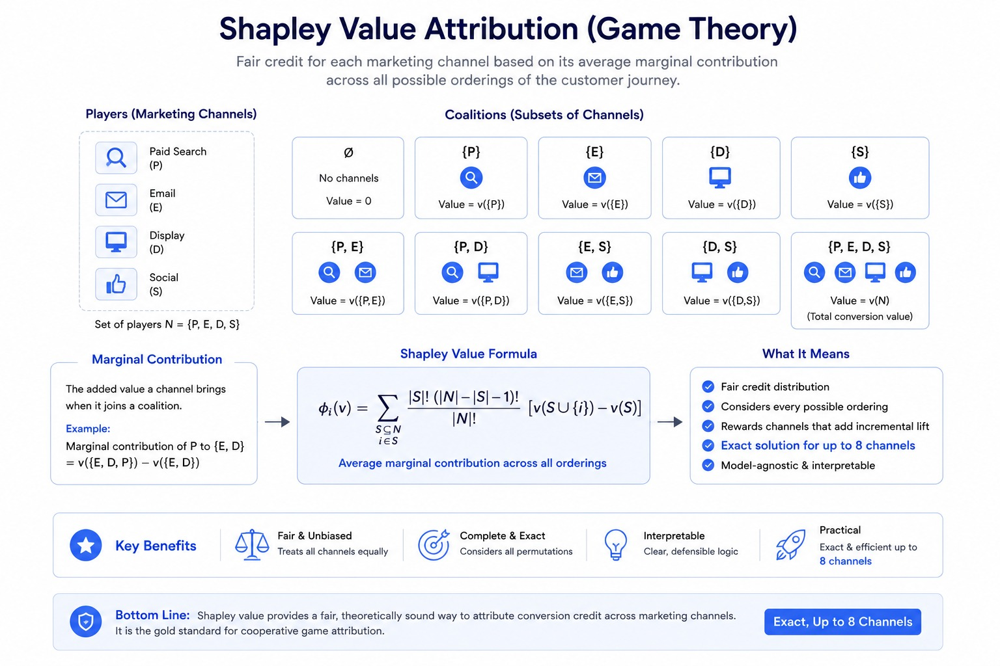

Implementation: [src/attribution/shapley.py](./src/attribution/shapley.py). The
[test suite](./tests/test_shapley.py) verifies the **efficiency axiom** (Shapley
values sum to the grand-coalition worth) - the property that makes the
allocation provably fair.

### 4.2 Markov Chain Path Analysis

Journeys are modelled as an **absorbing Markov chain** over
`start -> channels -> {conversion, null}`. A channel's **removal effect** - the
relative drop in overall conversion probability when it is removed from the
graph - gives its attribution share.

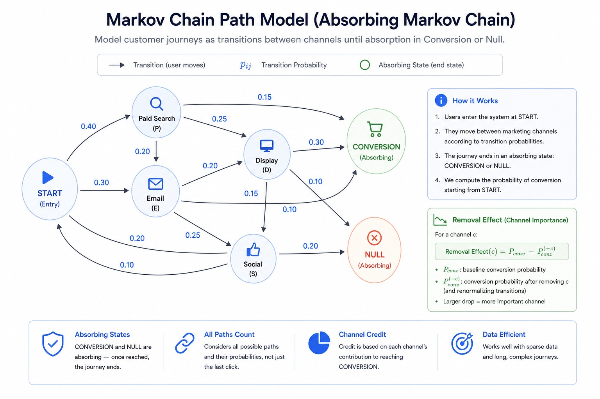

Implementation: [src/attribution/markov.py](./src/attribution/markov.py). The
transition-probability matrix is rendered as a heat-map:

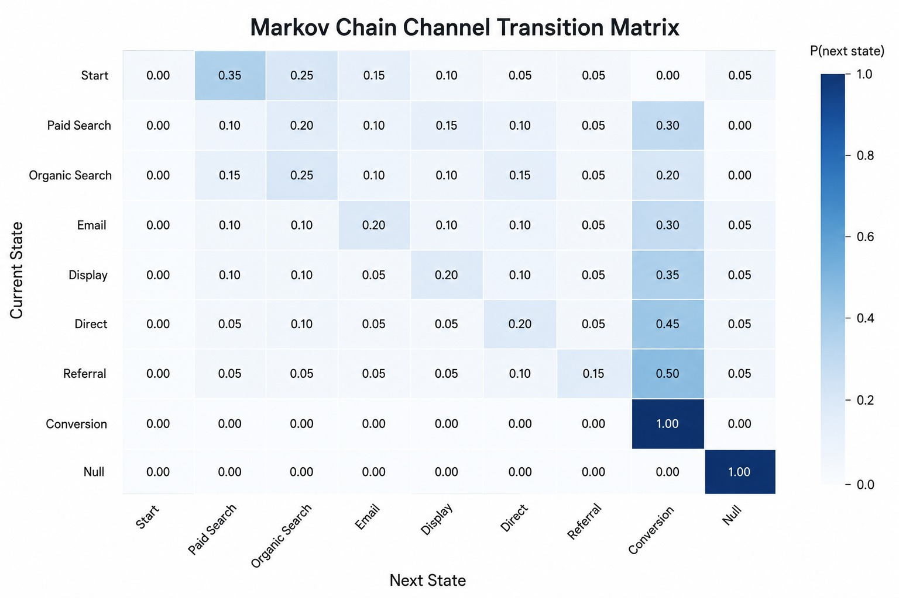

### 4.3 Composite Attribution Score

The composite blends fairness (Shapley) with structural necessity (Markov):

```text
composite_share = 0.70 * shapley_share + 0.30 * markov_share
```

Implementation: [src/attribution/composite.py](./src/attribution/composite.py).
The full model comparison across Shapley, Markov, composite, last-click,
first-click and linear:

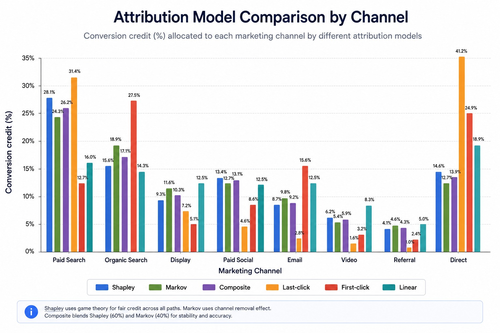

### 4.4 Shapley vs Last-Click Comparison

The headline result - Shapley re-credits the upper funnel that last-click
ignores. Worked explanation in
[docs/shapley_vs_lastclick.md](./docs/shapley_vs_lastclick.md):

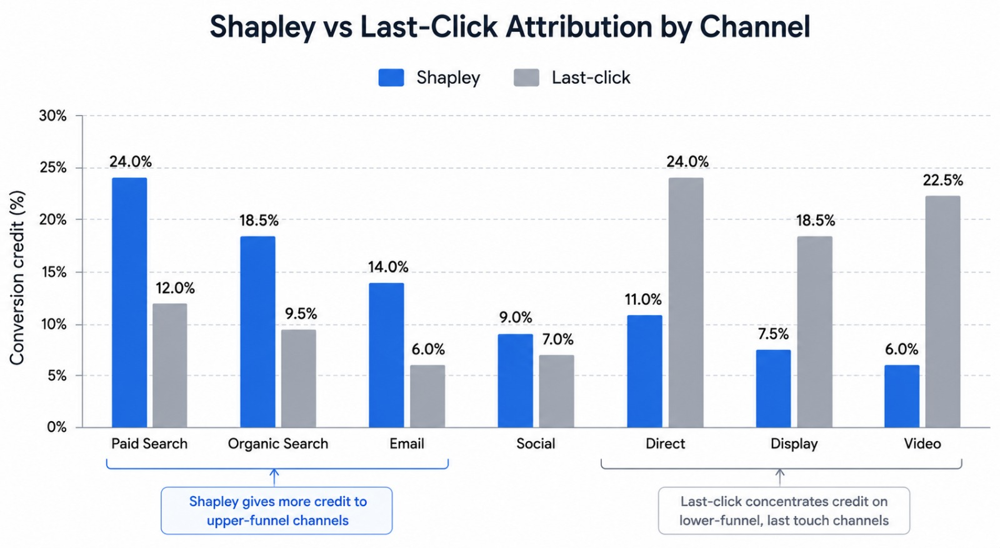

Last-click over-credits bottom-of-funnel channels (Direct, branded Paid Search)
that merely *close* journeys, while starving the awareness channels that
*initiate* them. Shapley corrects this - and the optimiser acts on the
correction.

## 5. Budget Optimization and the Attribution Advisor Agent

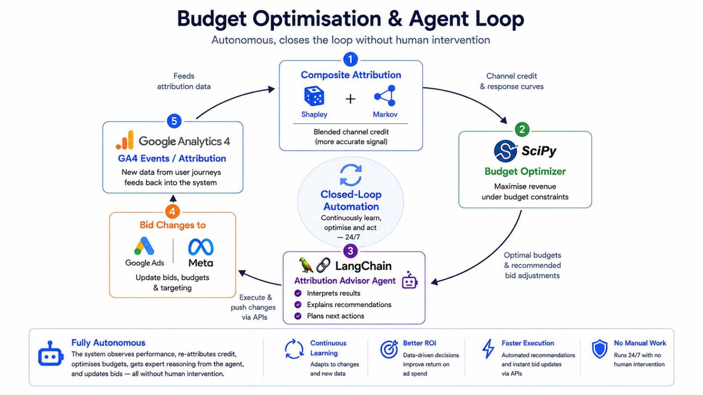

### 5.1 SciPy Constrained Budget Optimizer

Each channel's revenue response to spend is modelled with a concave power curve
(`revenue_i(s) = k_i * s^gamma`, `0 < gamma < 1`) whose coefficient is calibrated
from the composite attribution share. We then **maximise total revenue subject
to a fixed budget and per-channel min/max share** using SLSQP:

```text
maximise   sum_i  k_i * s_i^gamma
subject to sum_i  s_i = total_budget
           min_share*B <= s_i <= max_share*B
```

Implementation: [src/optimization/budget_optimizer.py](./src/optimization/budget_optimizer.py).
Current vs Shapley-optimised allocation:

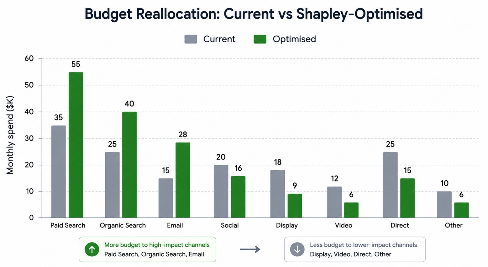

The reallocation lifts predicted blended ROAS materially:

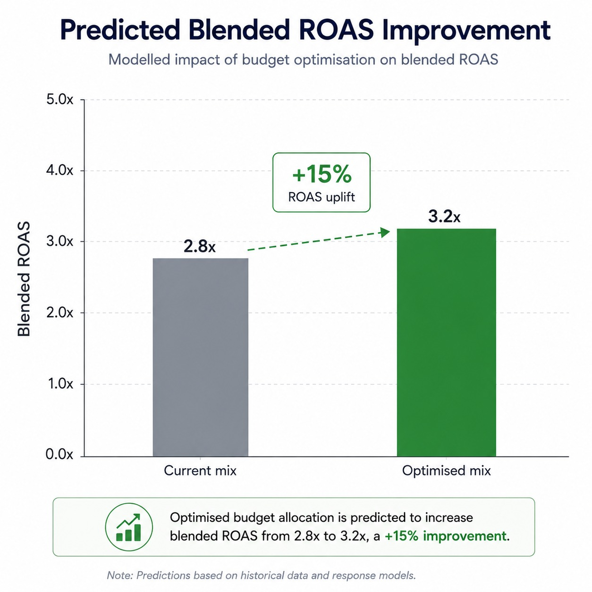

### 5.2 Budget Reallocation Simulator

[src/optimization/scenario.py](./src/optimization/scenario.py) scores arbitrary
channel-mix hypotheses against the same marginal-contribution curves. The
interactive **Streamlit** simulator
([dashboards/streamlit_simulator.py](./dashboards/streamlit_simulator.py)) lets
a marketer adjust the mix and see the predicted ROAS impact in real time:

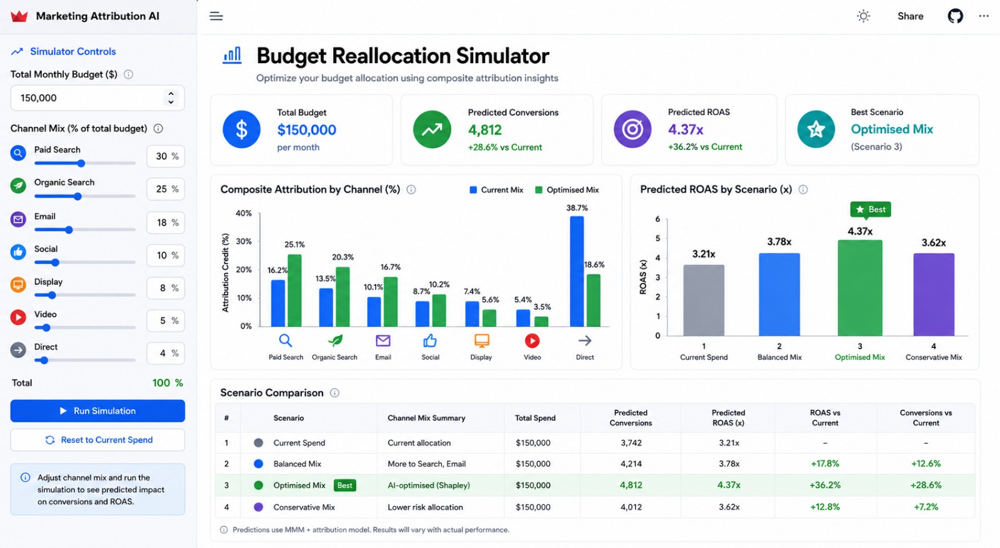

```bash
pip install -r requirements-cloud.txt
streamlit run dashboards/streamlit_simulator.py
```

### 5.3 LangChain Attribution Advisor Agent

The agent ([src/agent/advisor.py](./src/agent/advisor.py)) reads the composite
attribution table and the optimiser's allocation, identifies the top-N channels
to promote and bottom-N to trim, and generates a plain-English reallocation
rationale. With `GROQ_API_KEY` set it uses a **LangChain + Groq** LLM; otherwise
it falls back to a deterministic rule-based narrative so the loop always closes.

### 5.4 Autonomous Bid Adjustment (Google Ads + Meta)

The agent translates spend deltas into **capped bid changes** and calls the
**Google Ads** and **Meta Marketing** API clients - closing the optimisation
loop without human intervention. Each change (live or dry-run) is appended to
the agent audit log:

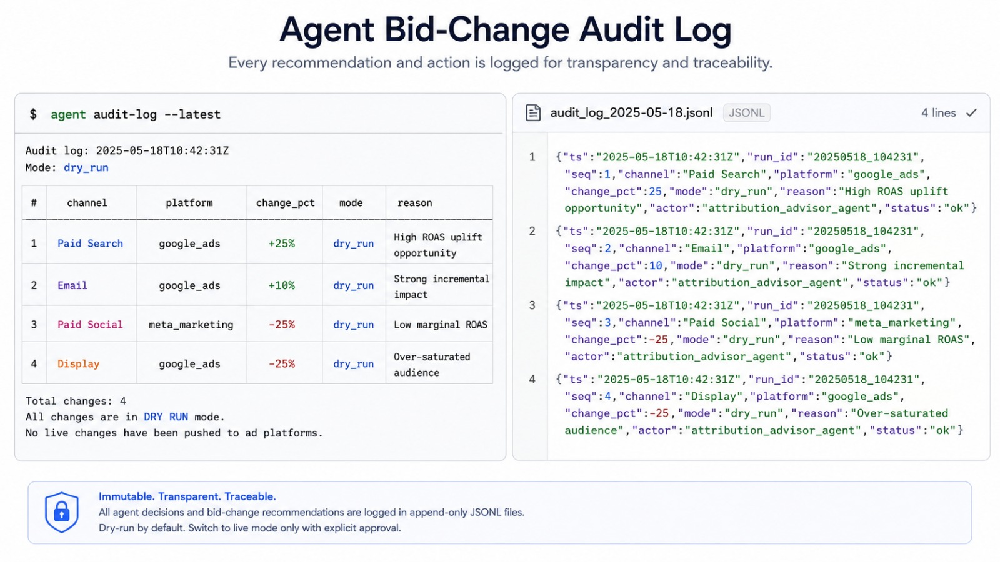

```python
from src.agent import GoogleAdsClient

client = GoogleAdsClient(apply_changes=True)   # requires APPLY_BID_CHANGES=true
client.adjust_bid(
    channel="Paid Search",
    current_bid=1.00,
    new_bid=1.20,                              # +20% toward a high-Shapley channel
    reason="composite-attribution reallocation",
)
```

A hard cap (`max_bid_shift_pct` in [config.yaml](./config.yaml)) prevents the
agent from ever making a reckless adjustment, and `APPLY_BID_CHANGES=false`
keeps it in safe dry-run mode by default.

## 6. Productionization, Testing and CI/CD

### 6.1 Project Structure

```text
multi-touch-attribution-intelligence/
├── main.py                       # CLI entrypoint (argparse): run / attribution
├── config.yaml                   # channels, weights, optimiser & agent settings
├── requirements.txt              # core (offline) dependencies
├── requirements-cloud.txt        # optional cloud / LLM integrations
├── .env.example                  # credential template (all optional)
├── src/
│   ├── config.py                 # config + environment loader
│   ├── pipeline.py               # end-to-end orchestration
│   ├── visualization.py          # chart generation (matplotlib / plotly)
│   ├── ingestion/                # GA4 -> BigQuery streaming + local fallback
│   │   ├── ga4_stream.py
│   │   └── bigquery_loader.py
│   ├── attribution/              # attribution engines
│   │   ├── shapley.py            # exact Shapley value engine
│   │   ├── markov.py             # Markov chain + removal effect
│   │   ├── composite.py          # composite scorer
│   │   └── baselines.py          # last-click / first-click / linear
│   ├── optimization/             # budget optimisation
│   │   ├── budget_optimizer.py   # SciPy constrained optimiser
│   │   └── scenario.py           # scenario / what-if analyser
│   └── agent/                    # autonomous Attribution Advisor
│       ├── advisor.py            # LangChain agent (LLM + rule-based fallback)
│       ├── google_ads_client.py  # Google Ads API client (+ mock)
│       └── meta_ads_client.py    # Meta Marketing API client (+ mock)
├── dbt/                          # session stitching, path construction, windows
│   └── models/{staging,marts}/
├── dashboards/                   # Streamlit simulator, Looker & Tableau configs
├── data/
│   └── journey_generator.py      # synthetic multi-channel journey generator
├── tests/                        # Shapley correctness, dbt logic, integration
└── docs/                         # methodology, Shapley vs last-click, API setup
```

### 6.2 Unit and Integration Tests

The suite covers Shapley correctness (incl. the efficiency axiom), Markov
matrix properties, optimiser budget/bound constraints and a full end-to-end
integration test.

```bash
pytest
```

Test files: [tests/test_shapley.py](./tests/test_shapley.py),
[tests/test_markov.py](./tests/test_markov.py),
[tests/test_optimization.py](./tests/test_optimization.py),
[tests/test_integration.py](./tests/test_integration.py).

### 6.3 CI/CD Workflow

A GitHub Actions workflow ([.github/workflows/ci.yml](./.github/workflows/ci.yml))
runs the test suite and a smoke run of the pipeline on every push and pull
request, ensuring attribution math and the optimiser stay correct.

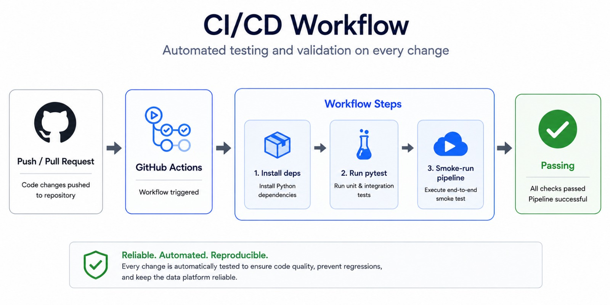

### 6.4 Monitoring and Agent Audit

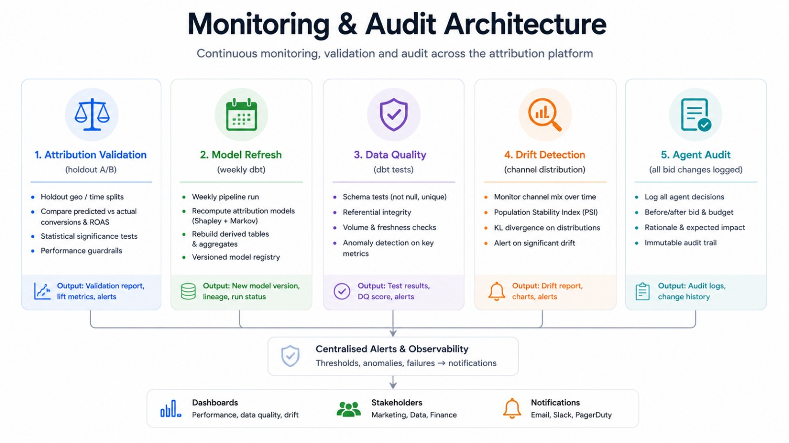

| Component | Purpose |
| --- | --- |
| Attribution validation | Holdout A/B: Shapley-optimised vs control spend |
| Model refresh | Weekly dbt recomputation of the rolling 30-day window |
| Data quality | dbt tests - journey completeness, event dedup |
| Drift detection | Monitor shifts in channel-distribution / journey patterns |
| Agent audit | Every API bid change logged to `outputs/agent_audit_log.jsonl` |

## 7. Conclusion

From this project, we built:

- **A fair attribution engine** - exact Shapley values that satisfy the
  efficiency, symmetry, null-player and additivity axioms.
- **A path-structure validator** - a Markov chain removal-effect model blended
  into a robust composite score.
- **A revenue optimiser** - SciPy constrained allocation that lifts predicted
  blended ROAS while respecting budget guardrails.
- **An autonomous agent** - a LangChain Attribution Advisor that closes the loop
  by driving Google Ads and Meta bid strategies.
- **A production-grade harness** - dbt transformations, tests, CI/CD and
  monitoring, all on a fully free-tier / offline-capable stack.

This delivers game-theoretically optimal attribution - historically locked
behind $50-200K/year tools - as open, reproducible code.

***Thank you for reading, happy optimising.***

## 8. Appendix

GitHub Topics: `marketing-attribution`, `shapley-values`, `markov-chain`,
`google-ads`, `ga4`, `bigquery`, `dbt`, `martech`.

### 8.1 Designs Gallery

- End-to-end Platform Architecture

- GA4 to BigQuery Data Flow

- Attribution Methodology (Shapley + Markov + Composite)

- Budget Optimisation & Autonomous Agent Loop

- Shapley vs Last-Click Comparison

- Customer Journey Sankey
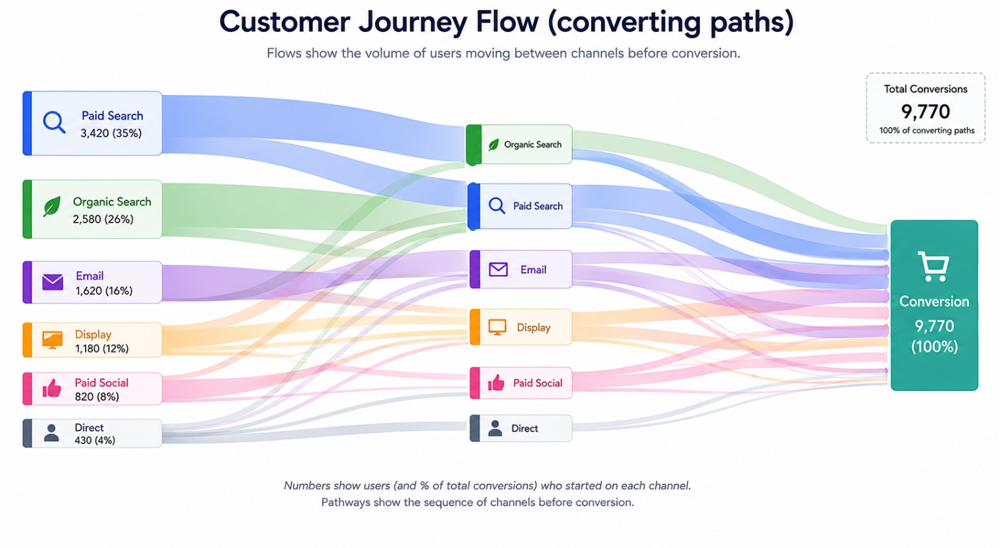
- Looker Studio Channel ROAS Dashboard
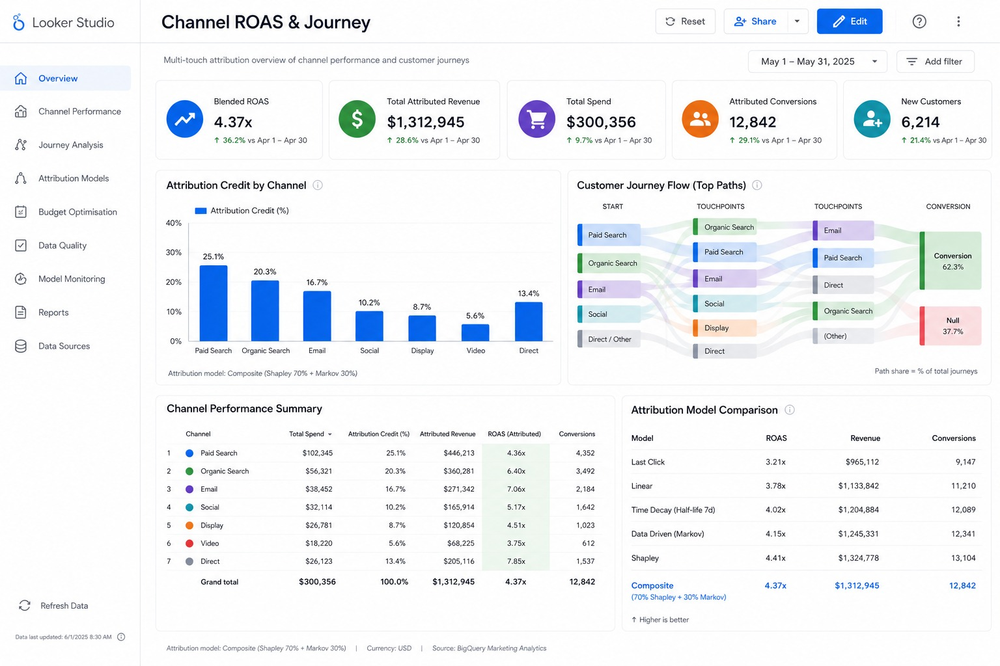
- CI/CD & Monitoring Architecture


**References:**
- [Shao & Li (2011) - Data-driven Multi-touch Attribution Models](https://dl.acm.org/doi/10.1145/2020408.2020453)
- [Shapley Value - Wikipedia](https://en.wikipedia.org/wiki/Shapley_value)
- [GA4 BigQuery Export schema](https://support.google.com/analytics/answer/7029846)
- [Markov Chains for Attribution - ChannelAttribution](https://channelattribution.io/)
- [SciPy `optimize.minimize` (SLSQP)](https://docs.scipy.org/doc/scipy/reference/generated/scipy.optimize.minimize.html)
- [LangChain Documentation](https://python.langchain.com/docs/introduction/)
- [Google Ads API](https://developers.google.com/google-ads/api/docs/start) and
  [Meta Marketing API](https://developers.facebook.com/docs/marketing-apis/)
